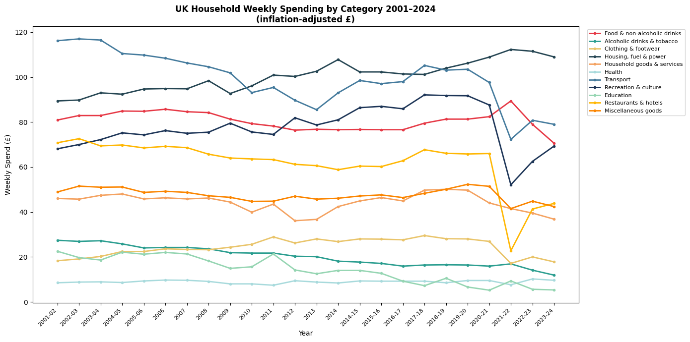
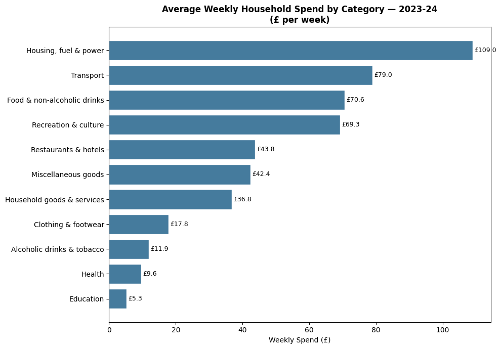
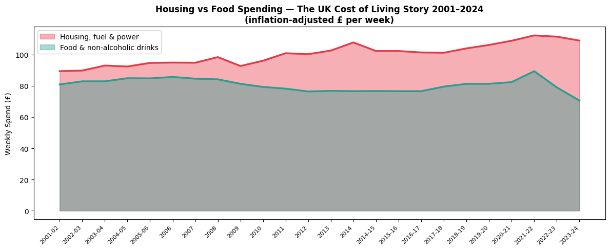
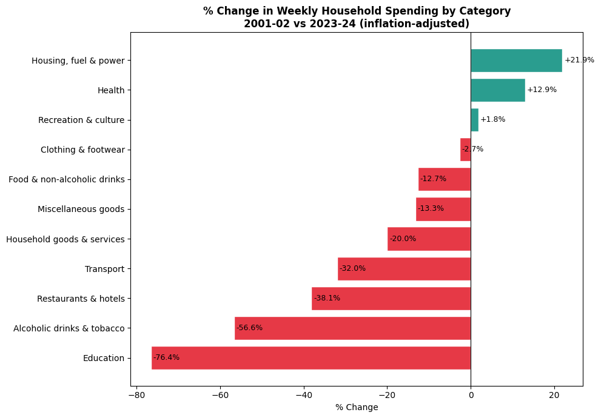
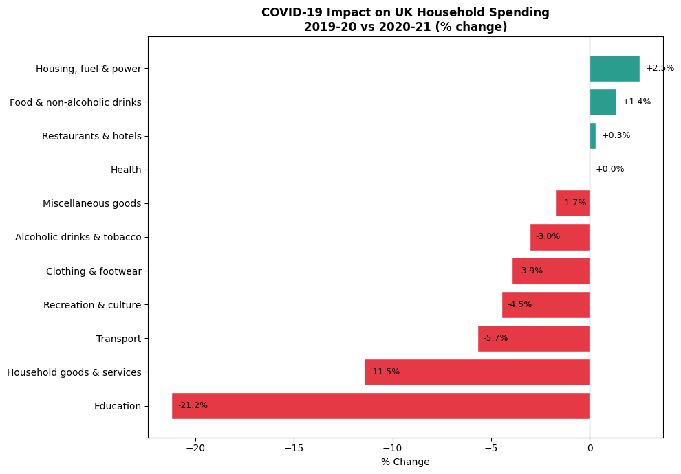

# 🇬🇧 UK Household Spending Patterns — ONS Analysis 2001–2024

**Author:** Limbani Fransisqo Chabwera  
**Tools:** Python · Pandas · Matplotlib · Seaborn  
**Data Source:** [Office for National Statistics (ONS) — Family Spending Workbook 1](https://www.ons.gov.uk/peoplepopulationandcommunity/personalandhouseholdfinances/expenditure/datasets/familyspendingworkbook1detailedexpenditureandtrends)  
**Environment:** Google Colab  

---

## 📌 Project Overview

This project analyses 23 years of UK household spending data sourced directly from the Office for National Statistics — the UK's national statistical authority. Unlike typical data analysis projects that rely on pre-cleaned Kaggle datasets, this project works with raw government Excel data, requiring real-world data extraction and cleaning skills.

The analysis covers average weekly household expenditure across 11 categories from 2001–02 to 2023–24, all adjusted for inflation, telling the story of how British households have changed their spending over two decades — through the 2008 financial crisis, austerity, and COVID-19.

---

## ❓ Questions Answered

1. How has spending across all categories trended over 23 years?
2. Where does the average UK household spend the most money in 2023–24?
3. How does housing cost compare to food spending over time?
4. Which categories have grown or declined the most since 2001?
5. How did COVID-19 change UK household spending behaviour?

---

## 📊 Charts & Findings

### Chart 1 — UK Household Spending Trends 2001–2024


**Finding:** Housing, fuel & power (dark blue) has been the dominant and growing expense throughout the period, sitting above all other categories and rising to £109/week by 2023–24. The dramatic dip visible across nearly all categories in 2020–21 marks the COVID-19 pandemic. Food spending (red) has remained remarkably stable in real terms across 23 years, suggesting households protect food budgets even during economic stress.

---

### Chart 2 — Average Weekly Spend by Category 2023–24


**Finding:** In 2023–24, UK households spend most on Housing, fuel & power at £109/week — more than Food (£70.60) and Transport (£79.00) combined. Education (£5.30) and Health (£9.60) remain the lowest categories, reflecting the UK's public provision of NHS and state education. Recreation & culture at £69.30 shows that British households prioritise leisure spending even under cost-of-living pressure.

---

### Chart 3 — Housing vs Food: The Cost of Living Story


**Finding:** Housing costs have consistently exceeded food spending every single year since 2001, and the gap has widened over time. By 2023–24, households spend £38.40 more per week on housing than food — a structural affordability challenge. The sharp dip in food spending in 2023–24 (despite rising nominal prices) suggests households are cutting food quantity or switching to cheaper options to manage budgets, a key indicator of financial stress.

---

### Chart 4 — 20-Year Spending Change 2001–2024


**Finding:** After adjusting for inflation, Housing (+21.9%) and Health (+12.9%) are the only major categories where real spending has increased over 23 years. Most categories have declined in real terms — Education (-76.4%), Alcoholic drinks & tobacco (-56.6%), Restaurants & hotels (-38.1%), and Transport (-32%). This tells a clear story: UK households are spending more on essential housing costs and less on everything else in real terms.

---

### Chart 5 — COVID-19 Impact on UK Household Spending


**Finding:** COVID-19 had a dramatic and highly category-specific impact on spending. Education fell the most (-21.2%) as schools and universities closed. Transport dropped -5.7% with movement restrictions. Recreation & culture fell -4.5% with venues closed. Meanwhile, Housing (+2.5%) and Food (+1.4%) increased — households spent more time at home. Notably, Restaurants & hotels showed only +0.3%, likely because takeaway spending offset closed venues.

---

## 💡 Key Takeaways

| # | Insight |
|---|---------|
| 1 | Housing is the UK's biggest household expense at **£109/week** — more than food and transport combined |
| 2 | In real terms, **most spending categories have declined** since 2001 — households are getting less for their money |
| 3 | Housing costs have grown **+21.9% in real terms** — the only major necessity to do so |
| 4 | COVID-19 caused a **-21.2% drop in education spending** — the largest single-year category shock |
| 5 | Food spending has stayed **remarkably flat in real terms** over 23 years despite significant price inflation |

---

## 🛠️ How to Run This Project

1. Download the ONS dataset from [this link](https://www.ons.gov.uk/peoplepopulationandcommunity/personalandhouseholdfinances/expenditure/datasets/familyspendingworkbook1detailedexpenditureandtrends)
2. Save the `.xlsx` file to your Google Drive
3. Open a new notebook in [Google Colab](https://colab.research.google.com)
4. Mount your Drive:
```python
from google.colab import drive
drive.mount('/content/drive')
```
5. Run the notebook cells in order

**Libraries used:**
```
pandas · matplotlib · seaborn · openpyxl
```

---

## 📁 Repository Contents

| File | Description |
|------|-------------|
| `ons_spending_analysis.ipynb` | Full analysis notebook |
| `ons_chart1.png` | Spending trends across all categories 2001–2024 |
| `ons_chart2.png` | Average weekly spend by category 2023–24 |
| `ons_chart3.png` | Housing vs food spending over time |
| `ons_chart4.png` | % change in spending by category 2001–2024 |
| `ons_chart5.png` | COVID-19 impact on spending by category |
| `README.md` | This file |

---

## 🔍 Why This Project Matters

The UK cost of living crisis is not just a news story — it is visible in 23 years of government data. This analysis shows that in real terms, British households are spending more on housing and less on almost everything else. As someone with an accounting background (ACCA) and experience working in UK logistics and retail, I bring both quantitative and operational context to interpreting these trends.

---

## 👤 About Me

I am a data analyst in training with a BSc in Mathematics, ACCA accounting qualifications, and hands-on experience in warehouse logistics at ALDI UK. This is my second portfolio project as part of a structured 6-month transition into a data analyst role.

📧 Connect with me on [LinkedIn](https://www.linkedin.com/in/fransisqo-chabwera-a3193a3ba/) · 🐙 More projects on [GitHub](#)
